# GooGoose

A local-first income & expense tracker for small business owners, built with Kotlin and Jetpack Compose.

[English](#english) | [中文](#中文)

---

## English

GooGoose helps a small business owner track daily transactions, keep an eye on stock, and see where the money actually goes — entirely on-device, with no account and no server.

### Features
**First launch guide page**
- Convenient language and currency selection
- Supports multiple startup methods, providing a quick and easy start-up experience, and also supports restoring previous data.
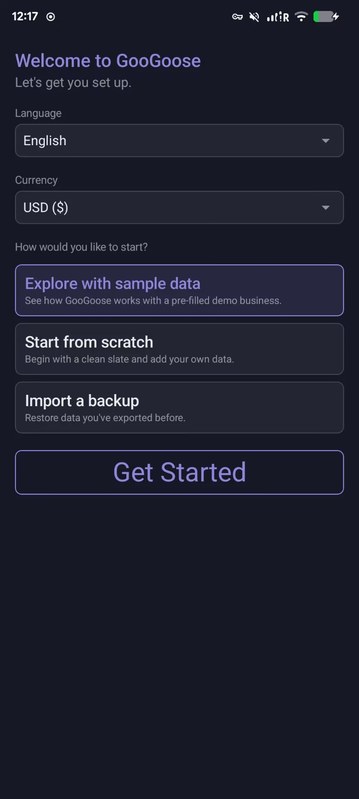

**Transactions**
- Add, edit, and delete transactions (income or spend) with category, amount, date, payment method, paid status, and remarks
- Filter by All / Income / Spend / **Unsolved** (unpaid), plus an independent "before a chosen date" filter that combines with the others
- Grouped by date (Today, Yesterday, …) with a running account balance and this-month net change
- Deleting a transaction requires a second confirmation — it can't be undone
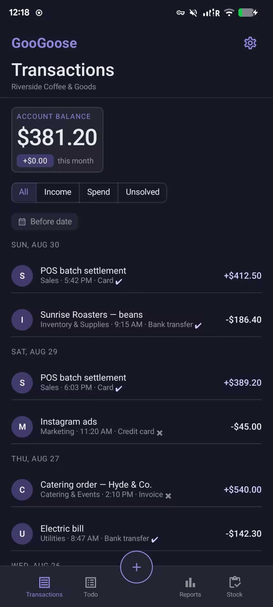
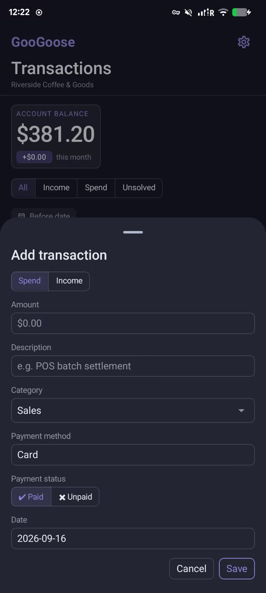
  
**Stock**
- Add and remove stock items with quantity, unit, and a low-stock threshold (auto-suggested at 20% of the starting quantity, or set your own)
- Quantity changes go through a confirmation step before they apply
- Items at or below their threshold get a visible low-stock warning on the card
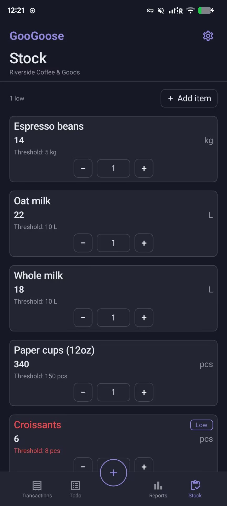

**Reports**
- Date range selector — All time / Month (30d) / Week (7d) / Day — scopes the stat cards and category breakdown
- Spend-or-income by category: pick which categories to include, see a colored bar list and a matching pie chart
- Last 7 days net cash flow, with the actual number on each bar and a warning when a day is negative or unusually low relative to the week's average
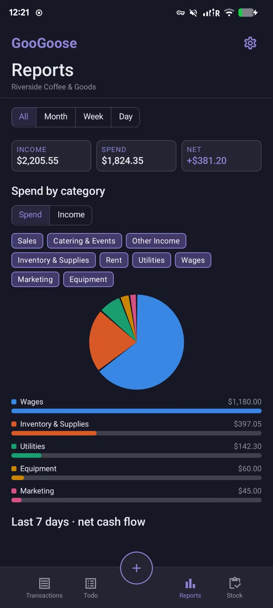

**Todo**
- Add tasks, mark them done, delete completed ones
- Undone tasks always sort first; completed tasks move to the end
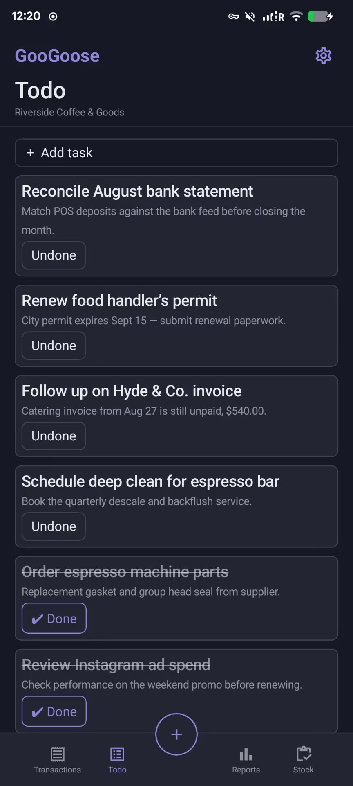

**Settings**
- Business name, currency (with the real symbol shown throughout the app, not just in Settings), and language
- Full English / 简体中文 localization — including date grouping, weekday abbreviations, and time-of-day formatting, not just button labels
- Adjustable text size (Small / Standard / Large), tuned per element rather than a single blanket zoom
- Export/import your entire dataset as JSON, with a confirmation step before an import overwrites local data
- About page with version, author, and source link
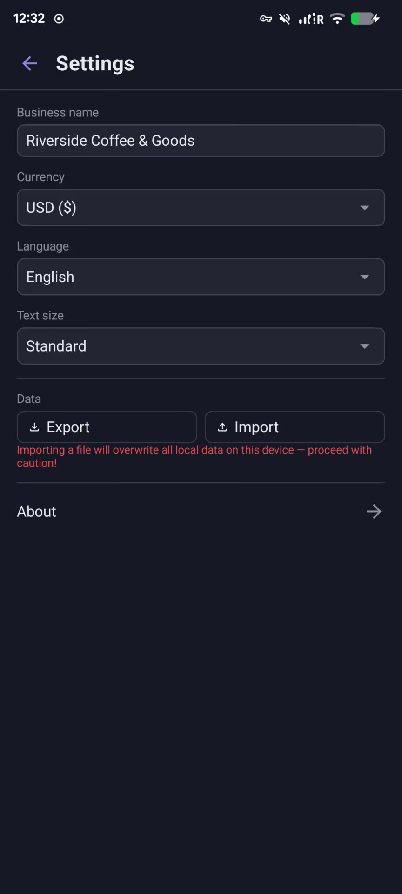

### Highlights

- **Local-first**: all data lives in a local Room (SQLite) database on the device — nothing leaves it, nothing needs an internet connection.
- **Real bilingual support**: switching language changes more than labels — dates, times, and weekday names follow proper conventions in each language.
- **Accessible category colors**: the Reports category palette is checked against colorblind-safety and contrast thresholds with an automated validator, not chosen by eye.
- **Confirms before anything irreversible**: deleting a transaction and importing a backup (which replaces all local data) both require an explicit second step.

### Tech stack

Kotlin · Jetpack Compose · Material3 · Room · MVVM (single `ViewModel` + `StateFlow`)

### Getting started

```bash
./gradlew assembleDebug
```

Requires a JDK compatible with the Android Gradle Plugin in use and the Android SDK (minSdk 24, target/compile SDK 37).

---

## 中文

GooGoose 是一款完全跑在设备本地的小商户记账 App——不用注册账号，不连服务器，帮你记录每天的收支、盯着库存、看清楚钱到底花在了哪。

### 核心功能

**首次启动引导页面**
- 自由选择语言与货币
- 支持多种方式启动，引导快速上手，同时支持恢复之前的数据
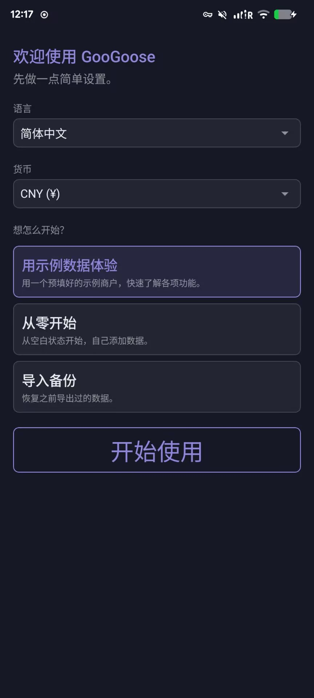

**交易记录**
- 新增、编辑、删除交易（收入或支出），可以填分类、金额、日期、付款方式、付款状态、备注
- 筛选支持 全部 / 收入 / 支出 / **未付款**，另外还有一个独立的"某日期之前"筛选，可以和其他筛选叠加使用
- 按日期分组显示（今天、昨天……），顶部有实时账户余额和本月净额变化
- 删除交易需要二次确认——删掉之后无法找回
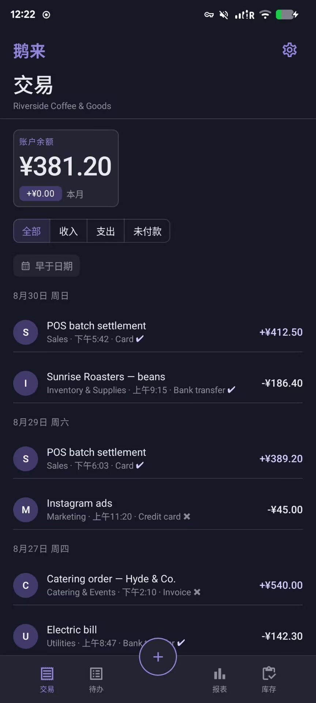

**库存**
- 新增、删除库存项目，可设置数量、单位和库存不足阈值（默认按起始数量的 20% 自动算，也可以自己填）
- 数量的增减都要先弹窗确认才会真正生效
- 低于阈值的项目会在卡片上有明显的库存不足提示
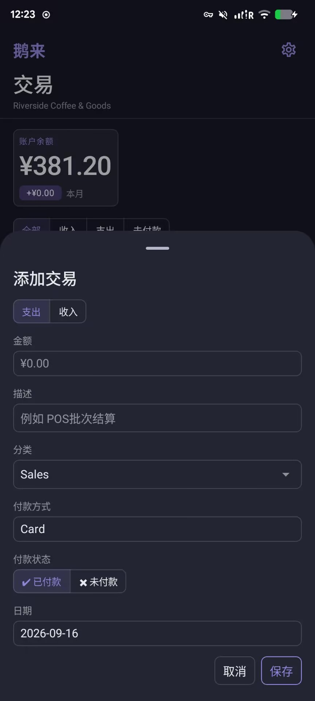
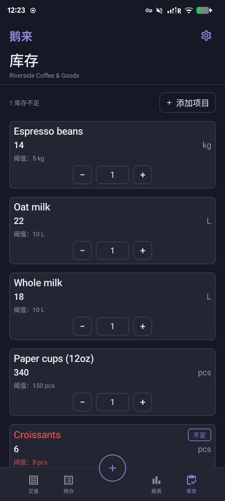

**报表**
- 顶部日期范围选择器——全部 / 月(30天) / 周(7天) / 日——控制上面的统计卡片和分类明细
- 支出或收入按分类统计：可以自选要看哪些分类，条形图和对应颜色的饼图一起展示
- 近7天净现金流图表，每根柱子下面有具体数字，某天现金流为负或明显低于本周平均水平时会有预警提示
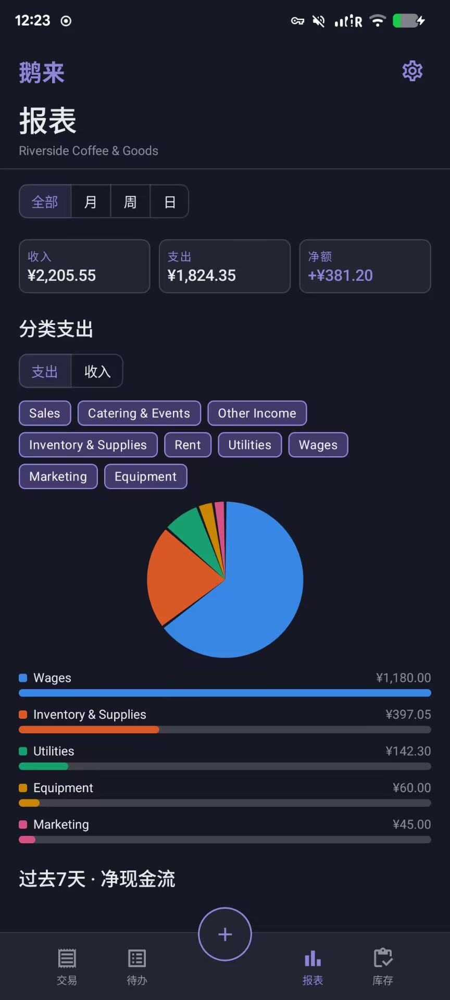

**待办事项**
- 新增任务、标记完成、删除已完成的任务
- 未完成的任务永远排在前面，完成的任务排到最后
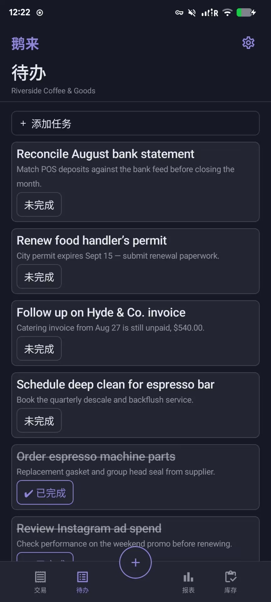

**设置**
- 商户名称、货币（选好之后全 app 的金额都会显示对应的真实符号，不只是设置页里）、语言
- 完整的中英文双语支持——不只是按钮文字，日期分组、星期缩写、时间格式也都跟着语言走
- 字号可调（小/标准/大），每种文字角色单独调过，不是简单整体拉伸
- 支持把全部数据导出/导入成 JSON 文件，导入前会有确认提示（导入会覆盖本地全部数据）
- 关于页面：版本号、作者、源码链接
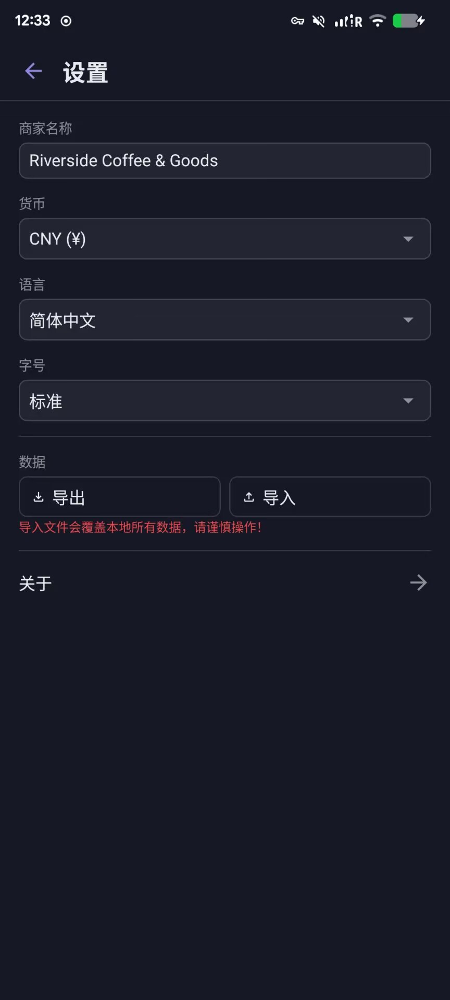

### 特色亮点

- **完全本地化**：所有数据都存在设备本地的 Room（SQLite）数据库里，不上传、不需要联网。
- **真正的双语支持**：切换语言影响的不只是文字标签，日期、时间、星期的表达方式在两种语言下都符合各自的习惯用法。
- **无障碍友好的分类配色**：报表页的分类颜色跑过自动化的色盲安全性和对比度校验，不是凭感觉挑的。
- **不可逆操作都有确认**：删除交易、导入备份（会覆盖本地全部数据）这两个操作都需要额外确认一步才会执行。

### 技术栈

Kotlin · Jetpack Compose · Material3 · Room · MVVM（单一 `ViewModel` + `StateFlow`）

### 本地构建

```bash
./gradlew assembleDebug
```

需要和当前 Android Gradle Plugin 版本兼容的 JDK，以及 Android SDK（minSdk 24，target/compile SDK 37）。
